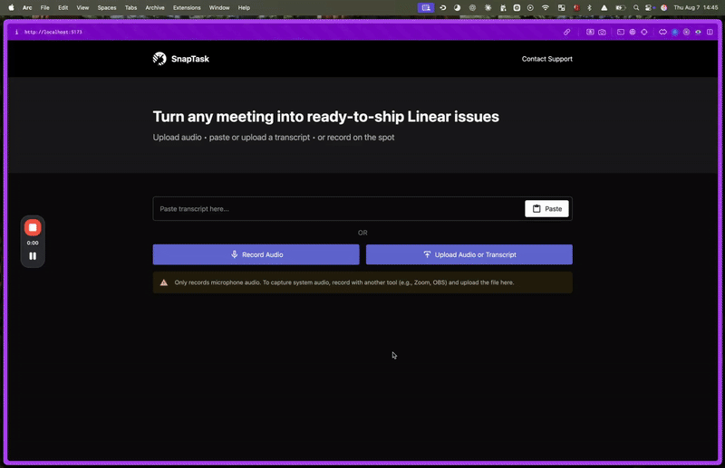

# SnapTask

> Convert your meeting recordings or transcripts into Linear issues & comments — powered by AI.




## 🌐 Hosted Demo
To try it out instantly, visit [https://snaptask.io/](https://snaptask.io/)  🚀


## 🎯 What is SnapTask?

SnapTask is an open-source tool that listens to your meetings (via audio upload or transcript) and automatically suggests well-scoped issues or comments in [Linear](https://linear.app).

It is built using the [Linear MCP](https://linear.app/docs/mcp) server, which allows it to be used with any Linear workspace.

It searches through your Linear workspace to find the best matching projects, teams, and users to create issues in.  It also looks for existing issues with similar titles and creates them if they don't exist.

## 🚀 Running Locally

### Prerequisites

- Node.js v14+
- A [Linear](https://linear.app) account

### Installation

1. **Clone the repo**

   ```bash
   git clone https://github.com/buildwithlayer/SnapTask.git
   cd SnapTask
   ```

2. **Install dependencies**
   ```bash
   npm install        # root
   ```

### Configuration

Copy the example env files and fill in your keys:

- Root `.env` (at project root):

  ```ini
  ASSEMBLYAI_API_KEY=          # API key for Assembly AI
  OPENAI_API_KEY=             # API key for OpenAI
  ```

- Client `.env` (in `/client`):
  ```ini
  VITE_API_URL=http://localhost:3001
  VITE_CALLBACK_URL=http://localhost:5173/oauth/callback
  ```

### Running Locally

From the root directory:

```bash
npm run dev:all
```

- ✅ Starts the back-end on `http://localhost:3001`
- ✅ Starts the front-end on `http://localhost:5173`

---

## 🤝 Contributing

We welcome contributions!

1. Fork the repo
2. Create a feature branch (`git checkout -b feature/foo`)
3. Commit your changes (`git commit -m "feat: add foo"`)
4. Push to your branch (`git push origin feature/foo`)
5. Open a Pull Request
